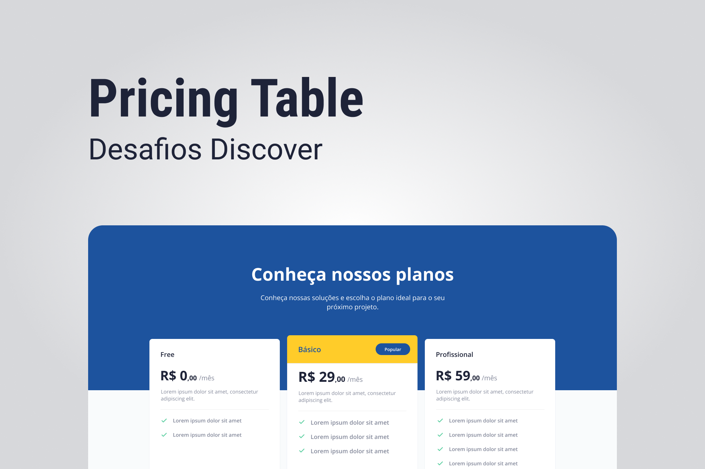

<h1 align="center">
  
</h1>

# ✅ **Requisitos**

---

O desafio do projeto é a construção de uma página para mostrar as opções de planos disponíveis para assinatura

**Requisitos para o desafio:**

- Seguir o layout do [Figma](https://www.figma.com/file/sSq019RDznSm3eyZoo3OHc/DD-Pricing-Table/duplicate/)

**_Se desafie também:_**

- Deixando o Layout responsivo

# 🎨 Style Guide

---

## **Cores:**

```css
:root {
  --yellow: #ffcc29;
  --blue: #1d539e;
  --gray: #828799;
  --page-background: #f9fbfc;
}
```

## **Tipo de fonte:**

font-family: Open Sans

font Weight: 400, 600 e 700

Você pode encontrar a fonte no [Google Fonts](https://fonts.google.com/)
